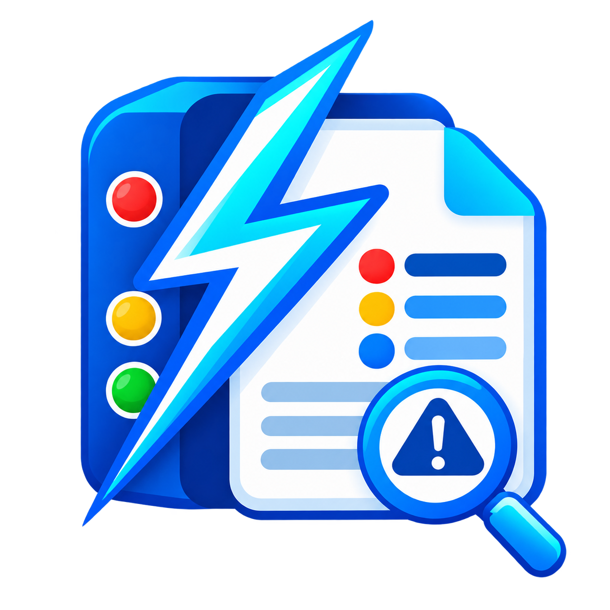

# EventFast



[English](README.md)

EventFast 是可攜式 Windows Event Log 查詢工具，直接讀取 Windows 原生事件 API，集中查詢、分組、檢視並匯出 System、Application 與離線 `.evtx`。

## 下載與安裝

從 [EventFast v1.0.4 Release](https://github.com/Honguan/EventFast/releases/tag/v1.0.4) 下載 `EventFast-v1.0.4-win-x64.exe`。支援 Windows 10／11 x64；單檔 self-contained，不需安裝程式或額外安裝 .NET Runtime。

## 使用方式

直接開啟 EXE，選擇時間、等級與 Channel，再以 Event ID、Provider、問題名稱或關鍵字搜尋。也可以把 `.evtx` 檔案拖入視窗。

```powershell
EventFast.exe --today
EventFast.exe --hours 24
EventFast.exe --event-id 51
EventFast.exe --provider disk
EventFast.exe --query "disk 153"
EventFast.exe C:\Logs\system.evtx
```

選取問題後可查看每次發生的時間與完整訊息；事件 XML 可在獨立的「解析 XML」分頁中以樹狀結構查看。按「匯出 Excel」可輸出問題摘要與完整事件工作表。

## 語言設定

英文是預設語言。可在主視窗的「語言」選單切換 English 與繁體中文；選擇會儲存在 `%LOCALAPPDATA%\EventFast\settings.json`，下次啟動時自動恢復。

## 開發與驗證

```powershell
dotnet run
dotnet run -- --self-test
dotnet publish -p:PublishProfile=win-x64
./scripts/release.ps1 -OutputDirectory artifacts/release-candidate
dotnet run --project tests/EventFast.Tests -c Release -- --integration --ui
```

## 隱私

EventFast 完全在本機處理事件資料，不蒐集遙測，也不會上傳 EVTX 或匯出檔。只有在使用者主動選擇「查詢可能原因」時，才會以預設瀏覽器開啟搜尋查詢。

## 疑難排解／FAQ

- **無法讀取 Channel：** EventFast 顯示按鈕時，請以系統管理員身分重新啟動。
- **無法顯示 Provider 訊息：** 仍可查看原始事件欄位與 XML。
- **查詢結果過多：** 請縮短時間，或增加 Event ID、Provider、關鍵字篩選；單次查詢上限為 1,000,000 筆。
- **語言設定未保留：** 請確認 `%LOCALAPPDATA%\EventFast` 可寫入；無效設定會回到英文。

## License

尚未指定開源授權；未經權利人許可不得再散布或修改。
